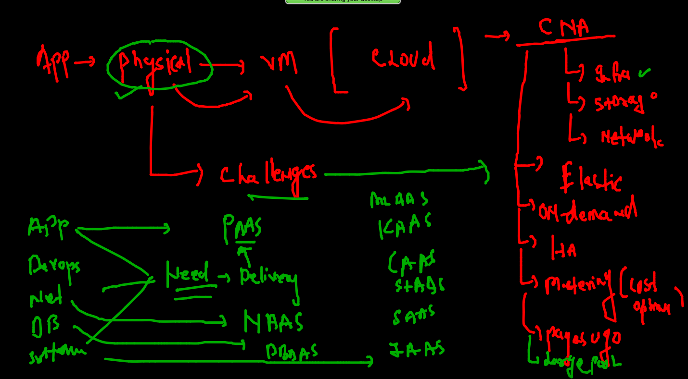

# Rev of CNA as of now



### a closure look to k8s 


### pod to k8s 


### k8s auto pod yaml generation 

```
kubectl  run  ashuwebpod  --image=dockerashu/ashuwebapp:v1  --port 80 --dry-run=client  -o yaml 
apiVersion: v1
kind: Pod
metadata:
  creationTimestamp: null
  labels:
    run: ashuwebpod
  name: ashuwebpod
spec:
  containers:
  - image: dockerashu/ashuwebapp:v1
    name: ashuwebpod
    ports:
    - containerPort: 80
    resources: {}
  dnsPolicy: ClusterFirst
  restartPolicy: Always
status: {}
 fire@ashutoshhs-MacBook-Air  ~/Desktop/myapp  kubectl  run  ashuwebpod  --image=dockerashu/ashuwebapp:v1  --port 80 --dry-run=client  -o yaml   >myapp.yaml 
 
 ```
 
 
