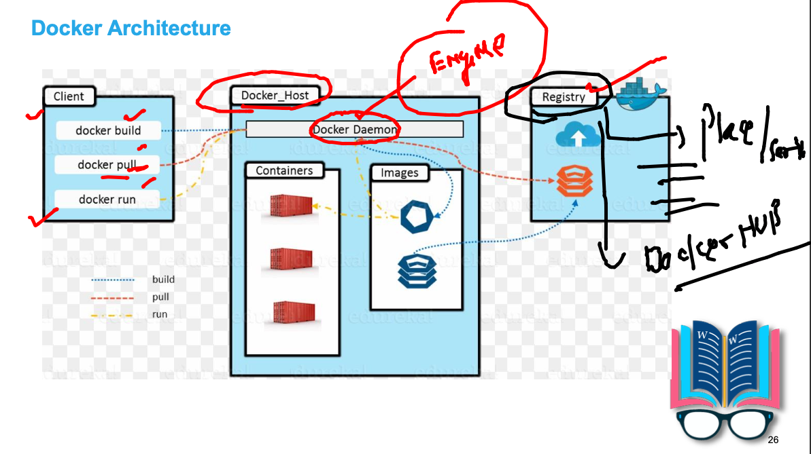
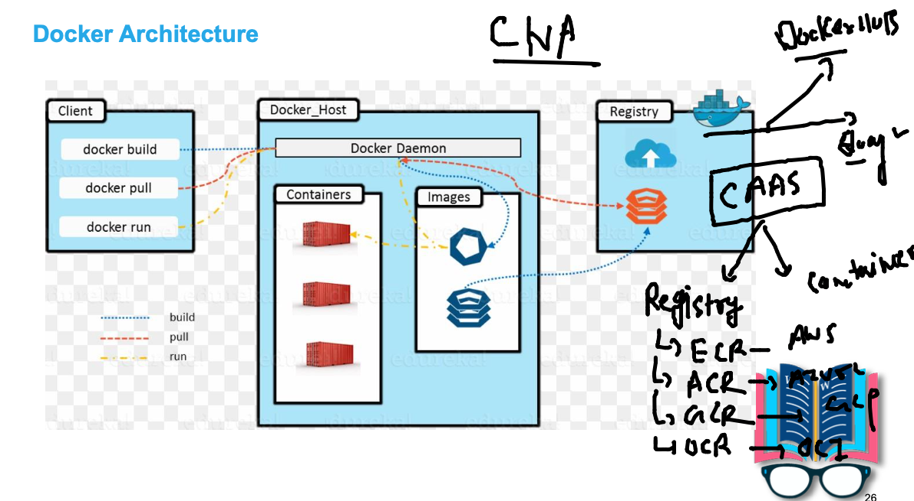
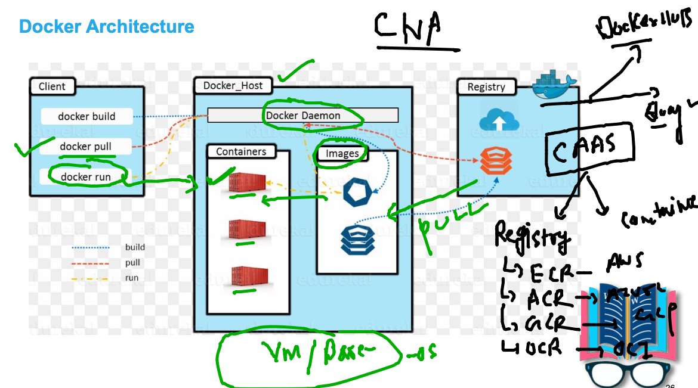
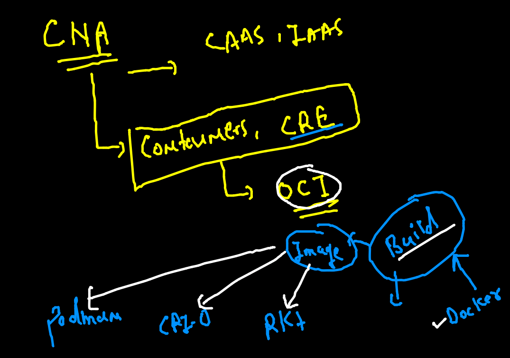
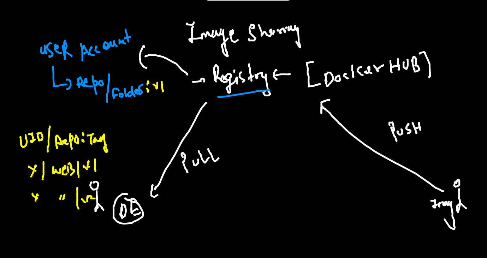

# CNA standards


### Docker architecture 


### After connecting from vscode we can do docker request

```
[ashutoshh@ip-172-31-31-134 ~]$ docker  images
REPOSITORY   TAG       IMAGE ID   CREATED   SIZE
[ashutoshh@ip-172-31-31-134 ~]$ docker  pull   alpine 
Using default tag: latest
latest: Pulling from library/alpine
a0d0a0d46f8b: Pull complete 
Digest: sha256:e1c082e3d3c45cccac829840a25941e679c25d438cc8412c2fa221cf1a824e6a
Status: Downloaded newer image for alpine:latest
docker.io/library/alpine:latest
[ashutoshh@ip-172-31-31-134 ~]$ docker  images
REPOSITORY   TAG       IMAGE ID       CREATED        SIZE
alpine       latest    14119a10abf4   2 months ago   5.6MB
[ashutoshh@ip-172-31-31-134 ~]$ 


```

### Docker registry 



###   CAAS



### creating container 



### Building my first webapp docker image 

```
[ashutoshh@ip-172-31-31-134 myapps]$ cd  project-website-template
[ashutoshh@ip-172-31-31-134 project-website-template]$ ls
css         embedding.html  img         js       menu.html  vid
Dockerfile  empty.html      index.html  LICENSE  README.md  widgets.html
[ashutoshh@ip-172-31-31-134 project-website-template]$ docker  build -t ashuwebapp:v1  .  
Sending build context to Docker daemon  2.215MB
Step 1/4 : FROM nginx
latest: Pulling from library/nginx
b380bbd43752: Pull complete 
fca7e12d1754: Pull complete 
745ab57616cb: Pull complete 
a4723e260b6f: Pull complete 
1c84ebdff681: Extracting     666B/666B

```

### Image build stands OCI 



### standard for pushing image to docker hub 



### pushing image to docker hub 

```
 21  docker  tag  ashuwebapp:v1  dockerashu/ashuwebapp:v1  
   22  docker  images
   23  docker  login  
   24  docker  push  dockerashu/ashuwebapp:v1
   
```


