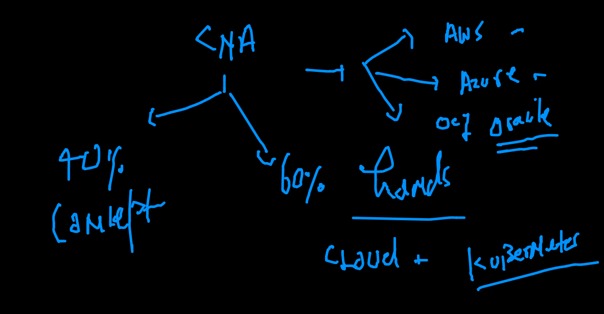
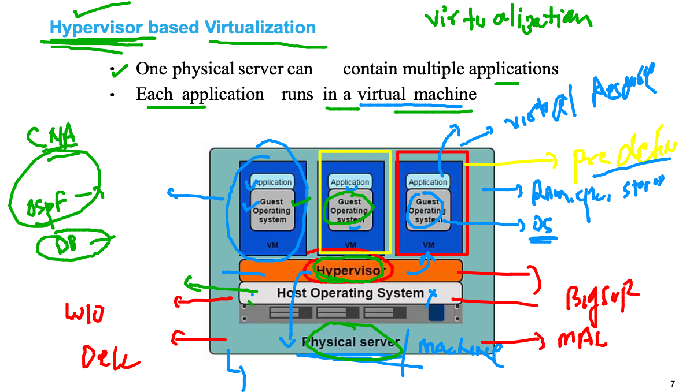
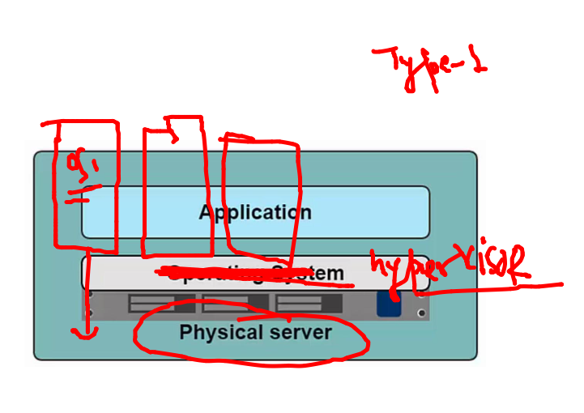
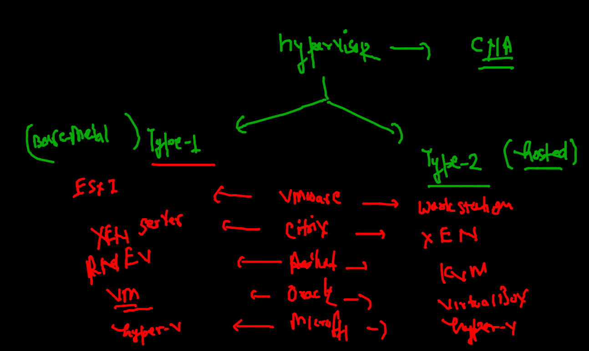
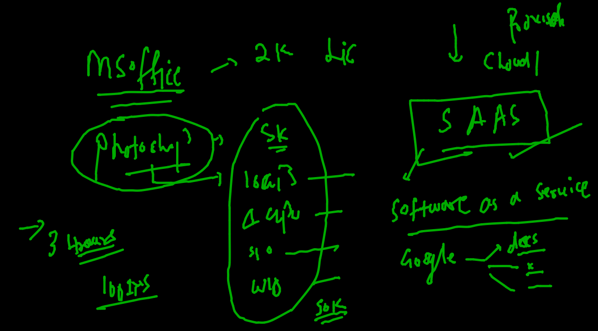
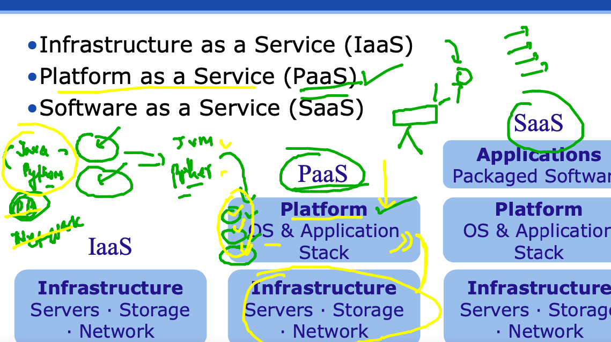
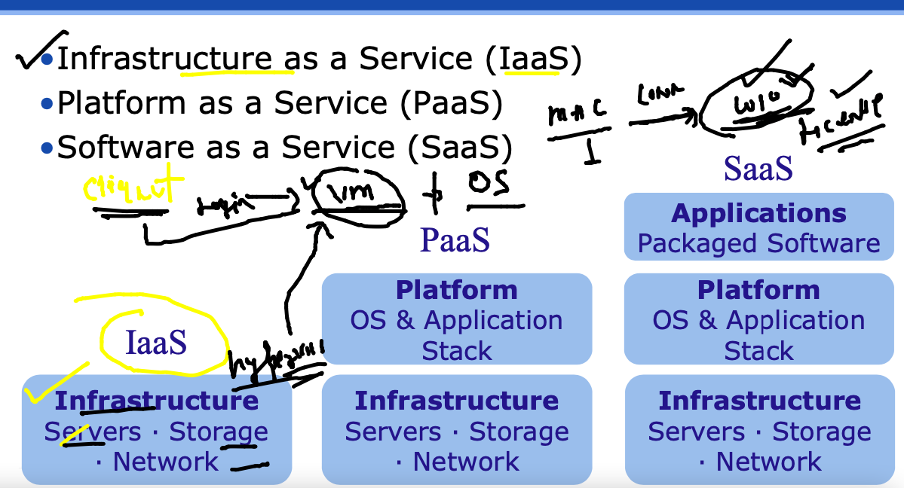
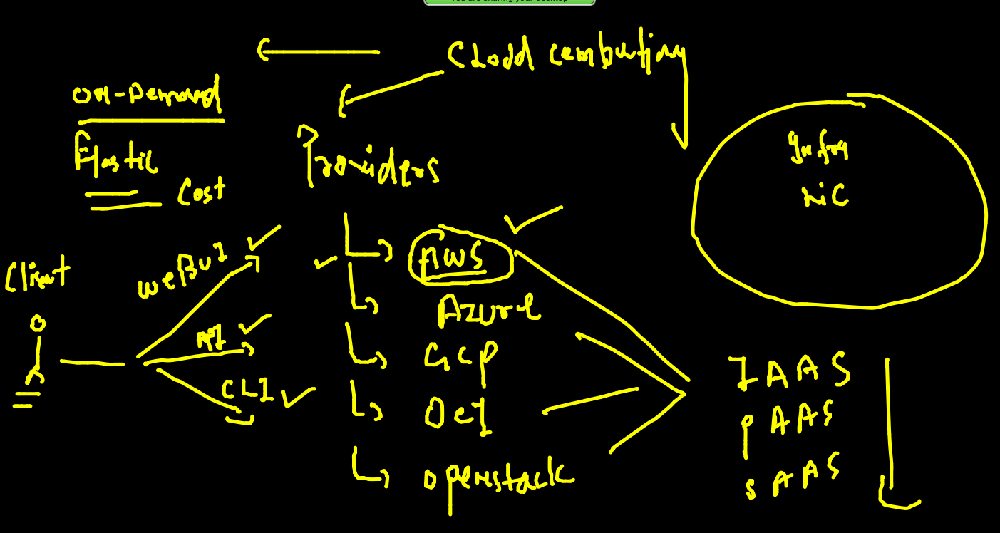
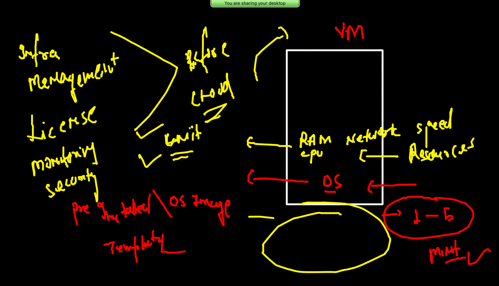
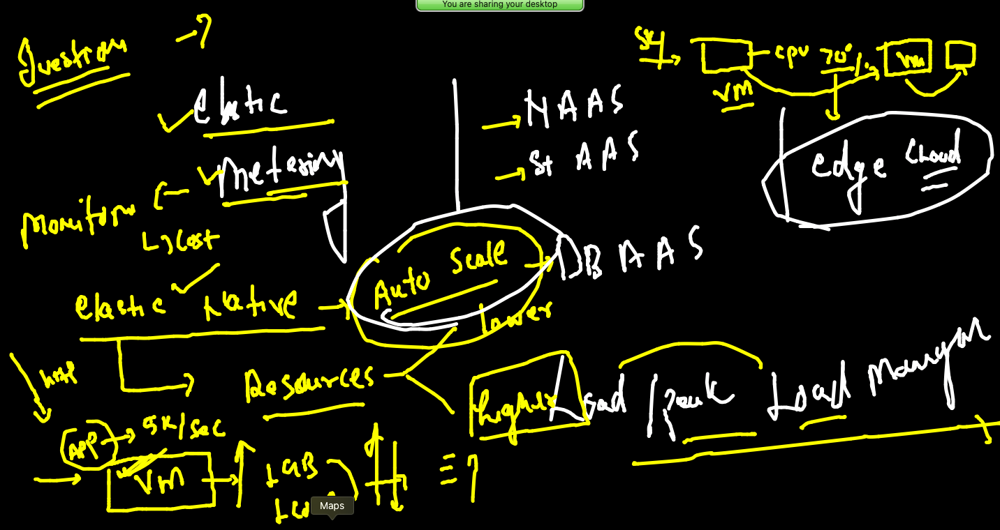

# Plan 



## problem with bare-metal setup for apps


### Intro to Hypervisor and VM 



### type 1 hyper visor 



## type of hypervisor 



## little view of DC 


## more problems with resources 


### CLoud -- SAAS 




### PAAS



### IAAS 



### CLoud platform providers



### Instance / VM creation 



### access amazon cloud vm using ssh 

```
ssh  -i  Desktop/ashutoshhkey.pem  ec2-user@3.144.161.150
The authenticity of host '3.144.161.150 (3.144.161.150)' can't be established.
ECDSA key fingerprint is SHA256:pNCxF/DQCzLxfwu3V24ph7dfwS49EolX5ZHjmp2OQ5Y.
Are you sure you want to continue connecting (yes/no/[fingerprint])? yes
Warning: Permanently added '3.144.161.150' (ECDSA) to the list of known hosts.
@@@@@@@@@@@@@@@@@@@@@@@@@@@@@@@@@@@@@@@@@@@@@@@@@@@@@@@@@@@
@         WARNING: UNPROTECTED PRIVATE KEY FILE!          @
@@@@@@@@@@@@@@@@@@@@@@@@@@@@@@@@@@@@@@@@@@@@@@@@@@@@@@@@@@@
Permissions 0644 for 'Desktop/ashutoshhkey.pem' are too open.
It is required that your private key files are NOT accessible by others.
This private key will be ignored.
Load key "Desktop/ashutoshhkey.pem": bad permissions
ec2-user@3.144.161.150: Permission denied (publickey,gssapi-keyex,gssapi-with-mic).
 ✘ fire@ashutoshhs-MacBook-Air  ~  
 ✘ fire@ashutoshhs-MacBook-Air  ~  chmod 600  Desktop/ashutoshhkey.pem 
 fire@ashutoshhs-MacBook-Air  ~  ssh  -i  Desktop/ashutoshhkey.pem  ec2-user@3.144.161.150

       __|  __|_  )
       _|  (     /   Amazon Linux 2 AMI
      ___|\___|___|

https://aws.amazon.com/amazon-linux-2/
3 package(s) needed for security, out of 15 available
Run "sudo yum update" to apply all updates.
-bash: warning: setlocale: LC_CTYPE: cannot change locale (UTF-8): No such file or directory
[ec2-user@ip-172-31-40-194 ~]$ 


```

###  cloud terminology discussion 




