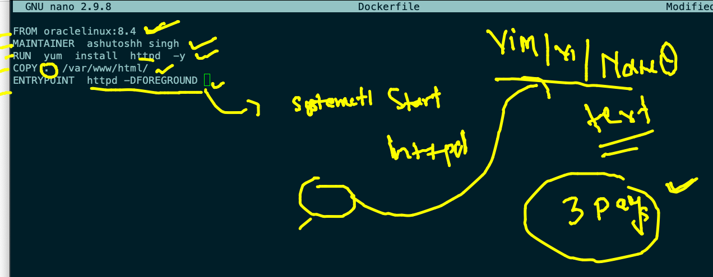

#  Day 2 

## to Deploy webapplication 


### to deploy web app in CLOud model  -- we can choose Delivery models


### Instance connection via ssh 

```
ssh -i Desktop/ashutoshhkey.pem  ec2-user@18.224.139.150
The authenticity of host '18.224.139.150 (18.224.139.150)' can't be established.
ECDSA key fingerprint is SHA256:6SNbP8GmSt7UInx61qm5zhFVNdXw8yD824uBIkvU1r4.
Are you sure you want to continue connecting (yes/no/[fingerprint])? yes
Warning: Permanently added '18.224.139.150' (ECDSA) to the list of known hosts.

       __|  __|_  )
       _|  (     /   Amazon Linux 2 AMI
      ___|\___|___|

https://aws.amazon.com/amazon-linux-2/
3 package(s) needed for security, out of 15 available
Run "sudo yum update" to apply all updates.
-bash: warning: setlocale: LC_CTYPE: cannot change locale (UTF-8): No such file or directory
[ec2-user@ip-172-31-31-215 ~]$ 
[ec2-user@ip-172-31-31-215 ~]$ whoami
ec2-user


```

### Download webapp and install httpd app server

```
[root@ip-172-31-17-13 ~]# history 
    1  yum  install  httpd  
    2  yum  install httpd
    3  yum  install httpd -ty
    4  yum install httpd 
    5  git  clone  https://github.com/yenchiah/project-website-template
    6  yum  install  git 
    7  history 
[root@ip-172-31-17-13 ~]# yum  install  git 
Failed to set locale, defaulting to C
Loaded plugins: extras_suggestions, langpacks, priorities, update-motd
Package git-2.32.0-1.amzn2.0.1.x86_64 already installed and latest version
Nothing to do
[root@ip-172-31-17-13 ~]# git  clone  https://github.com/yenchiah/project-website-template
Cloning into 'project-website-template'...
remote: Enumerating objects: 937, done.
remote: Total 937 (delta 0), reused 0 (delta 0), pack-reused 937
Receiving objects: 100% (937/937), 1.07 MiB | 10.51 MiB/s, done.
Resolving deltas: 100% (585/585), done.
[root@ip-172-31-17-13 ~]# ls
project-website-template


```

### copy webapp code to /var/www/html/

```
[root@ip-172-31-17-13 ~]# cp -rf  project-website-template/*  /var/www/html/
[root@ip-172-31-17-13 ~]# 
[root@ip-172-31-17-13 ~]# 
[root@ip-172-31-17-13 ~]# cd  /var/www/html/
[root@ip-172-31-17-13 html]# ls
LICENSE  README.md  css  embedding.html  empty.html  img  index.html  js  menu.html  vid  widgets.html
[root@ip-172-31-17-13 html]# 


```

### starting app server

```
cd  /var/www/html/
[root@ip-172-31-17-13 html]# ls
LICENSE  README.md  css  embedding.html  empty.html  img  index.html  js  menu.html  vid  widgets.html
[root@ip-172-31-17-13 html]# systemctl start httpd
[root@ip-172-31-17-13 html]# systemctl status httpd
● httpd.service - The Apache HTTP Server
   Loaded: loaded (/usr/lib/systemd/system/httpd.service; disabled; vendor preset: disabled)
   Active: active (running) since Tue 2021-10-26 05:58:56 UTC; 5s ago
     Docs: man:httpd.service(8)
 Main PID: 3691 (httpd)
   Status: "Processing requests..."
   CGroup: /system.slice/httpd.service
           ├─3691 /usr/sbin/httpd -DFOREGROUND
           ├─3692 /usr/sbin/httpd -DFOREGROUND
           ├─3693 /usr/sbin/httpd -DFOREGROUND
           ├─3694 /usr/sbin/httpd -DFOREGROUND
           ├─3695 /usr/sbin/httpd -DFOREGROUND
           └─3696 /usr/sbin/httpd -DFOREGROUND

Oct 26 05:58:56 ip-172-31-17-13.us-east-2.compute.internal systemd[1]: Starting The Apache HTTP Server...
Oct 26 05:58:56 ip-172-31-17-13.us-east-2.compute.internal systemd[1]: Started The Apache HTTP Server.

```

## monolithic to Micro services


### vm prob


### VM has entire OS but we don't need to just to run apps


### OS 


### hypervisor vs container runtime


### Hypervisor vs CRe


### Installing docker in vm 

```
23  yum  install  docker  
   24  history 
[root@ip-172-31-17-13 html]# systemctl start  docker 
[root@ip-172-31-17-13 html]# docker  version 
Client:
 Version:           20.10.7
 API version:       1.41
 Go version:        go1.15.14
 Git commit:        f0df350
 Built:             Tue Sep 28 19:55:50 2021
 OS/Arch:           linux/amd64
 Context:           default
 Experimental:      true

Server:
 Engine:
  Version:          20.10.7
  API version:      1.41 (minimum version 1.12)
  Go version:       go1.15.14
  Git commit:       b0f5bc3
  Built:            Tue Sep 28 19:56:28 2021
  OS/Arch:          linux/amd64
  Experimental:     false
 containerd:
  Version:          1.4.6
  GitCommit:        d71fcd7d8303cbf684402823e425e9dd2e99285d
 runc:
  Version:          1.0.0
  GitCommit:        84113eef6fc27af1b01b3181f31bbaf708715301
 docker-init:
  Version:          0.19.0
  GitCommit:        de40ad0

```

### COntainer vs VM app deploy


### app building using dockerfile


### Dockerfile 



### building docker images

```
[root@ip-172-31-17-13 project-website-template]# ls
Dockerfile  LICENSE  README.md  css  embedding.html  empty.html  img  index.html  js  menu.html  vid  widgets.html
[root@ip-172-31-17-13 project-website-template]# docker  build  -t  ashuhttpd:v1  . 
Sending build context to Docker daemon  2.215MB
Step 1/5 : FROM oraclelinux:8.4
 ---> 521767a68c46
Step 2/5 : MAINTAINER  ashutoshh singh
 ---> Running in 8e0732b57009
Removing intermediate container 8e0732b57009
 ---> 9c5a36129ed8
Step 3/5 : RUN  yum  install  httpd  -y
 ---> Running in 084870e98761
Oracle Linux 8 BaseOS Latest (x86_64)            39 MB/s |  36 MB     00:00    


```

### building and running 

```
docker  images
REPOSITORY               TAG       IMAGE ID       CREATED         SIZE
dockerashu/ciscowebapp   v1        e8d0f6d5116c   5 minutes ago   395MB
ashuhttpd                v1        e8d0f6d5116c   5 minutes ago   395MB
oraclelinux              8.4       521767a68c46   12 days ago     246MB
alpine                   latest    14119a10abf4   8 weeks ago     5.6MB
[root@ip-172-31-17-13 project-website-template]# docker  run  --name  ashuwebc1  -itd  -p 80:80  ashuhttpd:v1  
af4e014478a5ef50534acacbcd6c5eb53d640e6463a7494f3778b5e0436034c7
[root@ip-172-31-17-13 project-website-template]# docker  ps
CONTAINER ID   IMAGE          COMMAND                  CREATED         STATUS         PORTS                               NAMES
af4e014478a5   ashuhttpd:v1   "/bin/sh -c 'httpd -…"   5 seconds ago   Up 3 seconds   0.0.0.0:80->80/tcp, :::80->80/tcp   ashuwebc1


```

### Docker history 

```
 47  cd  project-website-template
   48  ls
   49  nano  Dockerfile
   50  cat  Dockerfile 
   51  ls
   52  docker  images
   53  ls
   54  docker  build  -t  ashuhttpd:v1  . 
   55  history 
   56  docker  images
   57  cat  Dockerfile 
   58  docker  tag  e8d0f6d5116c  dockerashu/ciscowebapp:v1  
   59  docker login -u dockerashu
   60  docker push  dockerashu/ciscowebapp:v1 
   61  docker  images
   62  docker  run  --name  ashuwebc1  -itd  -p 80:80  ashuhttpd:v1  
   63  docker  ps
   64  docker  stats
   65  history 
[root@ip-172-31-17-13 project-website-template]# docker  ps
CONTAINER ID   IMAGE          COMMAND                  CREATED         STATUS         PORTS                               NAMES
af4e014478a5   ashuhttpd:v1   "/bin/sh -c 'httpd -…"   2 minutes ago   Up 2 minutes   0.0.0.0:80->80/tcp, :::80->80/tcp   ashuwebc1
[root@ip-172-31-17-13 project-website-template]# cat  Dockerfile 
FROM oraclelinux:8.4
MAINTAINER  ashutoshh singh 
RUN  yum  install  httpd  -y 
COPY .  /var/www/html/
ENTRYPOINT  httpd -DFOREGROUND 


```

### accessing container 


