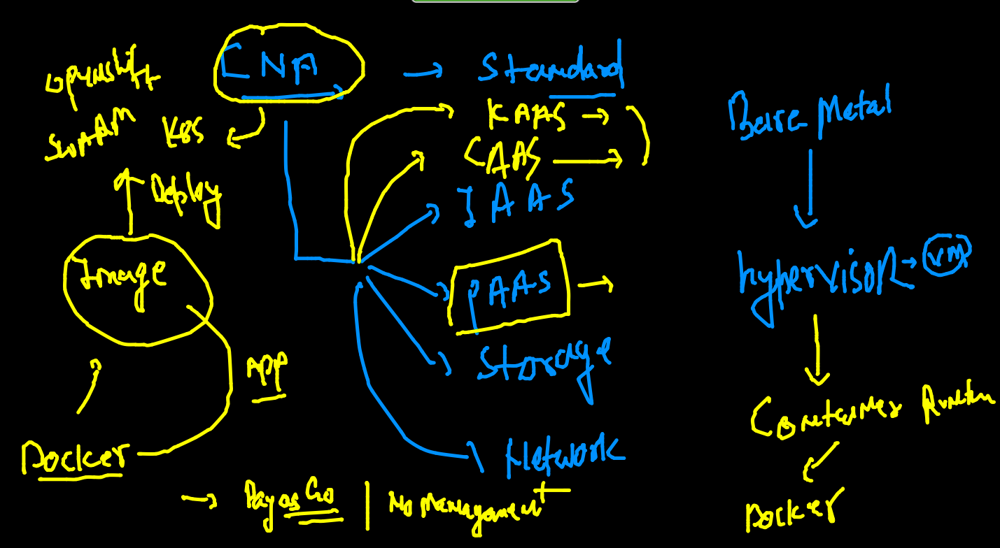

# Rev of CNA as of now



### a closure look to k8s 


### pod to k8s 


### k8s auto pod yaml generation 

```
kubectl  run  ashuwebpod  --image=dockerashu/ashuwebapp:v1  --port 80 --dry-run=client  -o yaml 
apiVersion: v1
kind: Pod
metadata:
  creationTimestamp: null
  labels:
    run: ashuwebpod
  name: ashuwebpod
spec:
  containers:
  - image: dockerashu/ashuwebapp:v1
    name: ashuwebpod
    ports:
    - containerPort: 80
    resources: {}
  dnsPolicy: ClusterFirst
  restartPolicy: Always
status: {}
 fire@ashutoshhs-MacBook-Air  ~/Desktop/myapp  kubectl  run  ashuwebpod  --image=dockerashu/ashuwebapp:v1  --port 80 --dry-run=client  -o yaml   >myapp.yaml 
 
 ```
 
 ### Deleting all the POD 
 
 ```
 kubectl delete pod  ashupod-1   
pod "ashupod-1" deleted
 fire@ashutoshhs-MacBook-Air  ~/Desktop/myapp  kubectl delete pods --all
pod "ashtiwa2pod-1" deleted
pod "deepupod1" deleted
pod "deepupod11" deleted
pod "hello" deleted
pod "hello1-node2" deleted
pod "rajpod1" deleted
pod "saranran" deleted
pod "vaibhav-1" deleted

```
### Deploy pod 

```
 kubectl  apply -f  myapp.yaml 
pod/ashuwebpod created
 fire@ashutoshhs-MacBook-Air  ~/Desktop/myapp  kubectl get  po 
NAME           READY   STATUS    RESTARTS      AGE
ashuwebpod     1/1     Running   0             4s
hello1-node2   1/1     Running   1 (18h ago)   59s
 fire@ashutoshhs-MacBook-Air  ~/Desktop/myapp  kubectl get  po  -o wide
NAME           READY   STATUS    RESTARTS      AGE   IP                NODE    NOMINATED NODE   READINESS GATES
ashuwebpod     1/1     Running   0             12s   192.168.166.169   node1   <none>           <none>
hello1-node2   1/1     Running   1 (18h ago)   67s   192.168.104.17    node2   <none>           <none>
```
### Problem with POD 


### k8s deployment 


### creating deployment YAML 

```
kubectl  create deployment  ashuweb  --image=dockerashu/ashuwebapp:v1  --dry-run=client  -o yaml 
apiVersion: apps/v1
kind: Deployment
metadata:
  creationTimestamp: null
  labels:
    app: ashuweb
  name: ashuweb
spec:
  replicas: 1
  selector:
    matchLabels:
      app: ashuweb
  strategy: {}
  template:
    metadata:
      creationTimestamp: null
      labels:
        app: ashuweb
    spec:
      containers:
      - image: dockerashu/ashuwebapp:v1
        name: ashuwebapp
        resources: {}
status: {}
 fire@ashutoshhs-MacBook-Air  ~/Desktop/myapp  kubectl  create deployment  ashuweb  --image=dockerashu/ashuwebapp:v1  --dry-run=client  -o yaml  >deployment.yaml 

```

###

```
kubectl apply -f  deployment.yaml 
deployment.apps/ashuweb created
 fire@ashutoshhs-MacBook-Air  ~/Desktop/myapp  kubectl  get deployment 
NAME      READY   UP-TO-DATE   AVAILABLE   AGE
ashuweb   1/1     1            1           8s
 fire@ashutoshhs-MacBook-Air  ~/Desktop/myapp  
 fire@ashutoshhs-MacBook-Air  ~/Desktop/myapp  kubectl  get  po 
NAME                       READY   STATUS    RESTARTS      AGE
ashuweb-7764fc5df4-wznzn   1/1     Running   0             20s
hello1-node2               1/1     Running   1 (18h ago)   3m26s
 fire@ashutoshhs-MacBook-Air  ~/Desktop/myapp  kubectl delete po ashuweb-7764fc5df4-wznzn
pod "ashuweb-7764fc5df4-wznzn" deleted
 fire@ashutoshhs-MacBook-Air  ~/Desktop/myapp  kubectl  get  po                          
NAME                       READY   STATUS    RESTARTS      AGE
ashuweb-7764fc5df4-nd2j2   1/1     Running   0             4s
hello1-node2               1/1     Running   1 (18h ago)   3m38s

```

### scaling pod 

```
 kubectl  scale  deployment  ashuweb  --replicas=3
deployment.apps/ashuweb scaled
 fire@ashutoshhs-MacBook-Air  ~/Desktop/myapp  kubectl get deploy                               
NAME         READY   UP-TO-DATE   AVAILABLE   AGE
ashuweb      3/3     3            3           4m12s
chandra      1/1     1            1           95s
deepuweb     1/1     1            1           67s
rajweb       1/1     1            1           84s
saranweb     1/1     1            1           2m9s
vaibhavweb   1/1     1            1           106s
 fire@ashutoshhs-MacBook-Air  ~/Desktop/myapp  kubectl get po                                   
NAME                          READY   STATUS    RESTARTS      AGE
ashuweb-7764fc5df4-bhcgx      1/1     Running   0             14s
ashuweb-7764fc5df4-nd2j2      1/1     Running   0             3m54s
ashuweb-7764fc5df4-sh5kw      1/1     Running   0             14s

```

### all the deployments 

```
59s
 fire@ashutoshhs-MacBook-Air  ~/Desktop/myapp  kubectl delete deployment  ashuweb 
deployment.apps "ashuweb" deleted
 fire@ashutoshhs-MacBook-Air  ~/Desktop/myapp  kubectl delete deployment  --all   
deployment.apps "ashtiwaweb" deleted
deployment.apps "chandra" deleted
deployment.apps "deepuweb" deleted
deployment.apps "rajweb" deleted
deployment.apps "saranweb" deleted

```

