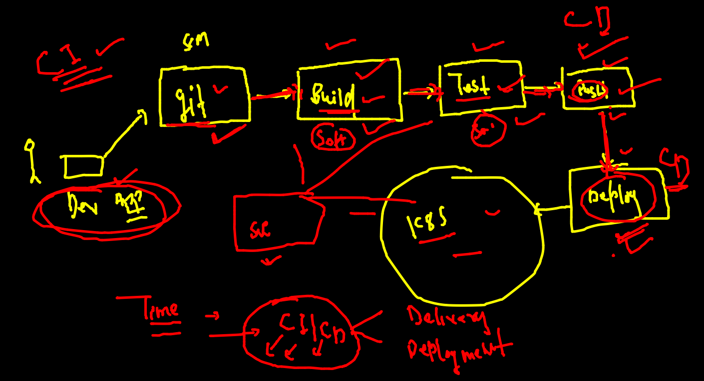
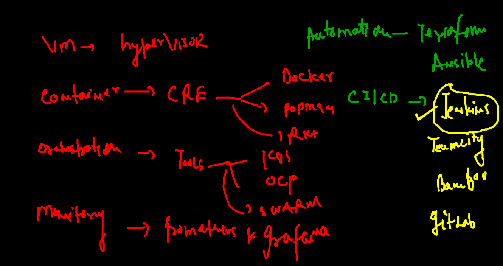

# ciscoCNA_25oct2021

## revision 


### cloud model 


### principle of CNA : 

### COntainer security 


## CI | CD 




### Devops tool industry 



### MLOPS -- CNA with Machine learning and AI 


###  AI in form of CNML 


### getting started with Microservices and --understanding service Mesh

### Micro service 


### microservices app Desing and logics 


### Injection of SIdecar container in MS


### Istio Link 

[Istio Link](https://istio.io/latest/docs/setup/getting-started/#download)

### Installing Istio in existing cluster 

```
istio-1.11.4/bin/istioctl version 
client version: 1.11.4
control plane version: 1.11.4
data plane version: 1.11.4 (1 proxies)
 fire@ashutoshhs-MacBook-Air  ~  
 fire@ashutoshhs-MacBook-Air  ~  
 fire@ashutoshhs-MacBook-Air  ~  istio-1.11.4/bin/istioctl  install  
This will install the Istio 1.11.4 default profile with ["Istio core" "Istiod" "Ingress gateways"] components into the cluster. Proceed? (y/N) y
✔ Istio core installed                                                                                              
✔ Istiod installed                                                                                                  
✔ Ingress gateways installed                                                                                        
✔ Installation complete                                                                                             
Thank you for installing Istio 1.11.  Please take a few minutes to tell us about your install/upgrade experience!  https://forms.gle/kWULBRjUv7hHci7T6


```

### CRE 


